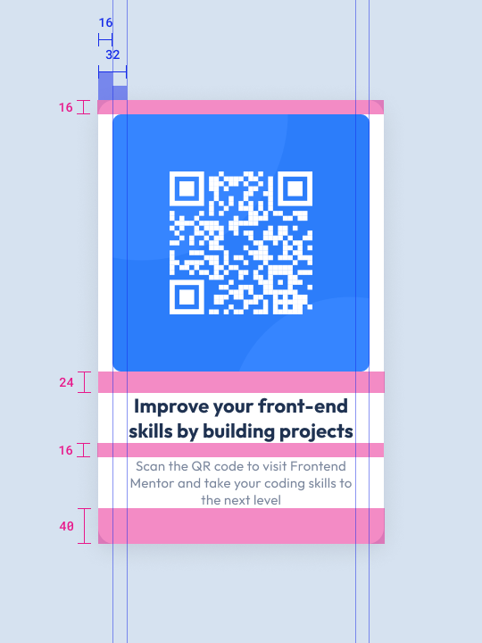

# Frontend Mentor - QR code component solution v1

This is a solution to the [QR code component challenge on Frontend Mentor](https://www.frontendmentor.io/challenges/qr-code-component-iux_sIO_H). Frontend Mentor challenges help you improve your coding skills by building realistic projects.

Angular is only used for project convenience, all relevant code is in
 - qr-code-v1.component.html
 - qr-code-v1.component.scss

## Overview

### Screenshot


### Figma Reversed
 

### Links

[//]: # (- Solution URL: [Add solution URL here]&#40;https://your-solution-url.com&#41;)
- Live Site URL: [https://rb-fem.netlify.app/qr-code/v1](https://rb-fem.netlify.app/qr-code/v1)

## My process
I used Figma to get dimensions and properties from the provided challenge screenshot. Then used plain html and css to build a solution.

### Built with

- Angular just for convenient project
- basic html & css
- display:flex ~~align-self: center~~ + margin:auto for vertical centering
  


### What I learned

- Stumbled upon [margin collapse](https://www.joshwcomeau.com/css/rules-of-margin-collapse/). I ran into this problem several times at work, not really questioning it then. 

- Need to learn when to use padding vs margin.

- Finally an easy solution for centering on x & y!

  [flexbox & auto-margin](https://css-tricks.com/the-peculiar-magic-of-flexbox-and-auto-margins/)
  ```css
  .parent {
    display: flex;
  } 
  .center {
    margin: auto;
  }
  ```
- [img tags can add invisible spacings](https://stackoverflow.com/a/1383220)

### Continued development

- dynamic qr code
- background with circles by using css
- better css conventions, maybe BEM
- refactoring css to proper scss
